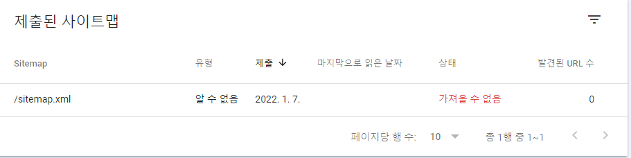

> ## Content Index
> Fetch the complete content index at: http://64.110.107.153:2368/llms.txt
> Use this file to discover other available public pages before exploring further.

# Jekyll 따라하기(6) - Google Search Console
- URL: http://64.110.107.153:2368/jekyll-googlesearchconsole/
- Published: 2021-01-08T10:00:00.000Z
- Updated: 2021-01-08T10:00:00.000Z
- Author: Noah Sim

Jekyll 따라하기의 목차입니다.

- [Jekyll 따라하기(0) - Jekyll Start](./jekyll-start)
- [Jekyll 따라하기(1) - Jekyll Setup](./jekyll-setup)
- [Jekyll 따라하기(2) - Jekyll Modify and Publish](./jekyll-modifyAndPublish)
- [Jekyll 따라하기(3) - Jekyll Web Font](./jekyll-webFont)
- [Jekyll 따라하기(4) - Highlighting with rouge](./jekyll-highlighting)
- [Jekyll 따라하기(5) - Search function with lunr.js](./jekyll-searchFunction)
- [Jekyll 따라하기(6) - Google Search Console](./jekyll-googleSearchConsole)
- [Jekyll 따라하기(7) - GitHub Gist](./jekyll-gitHubGist)
- [Jekyll 따라하기(8) - Travis CI](./jekyll-travisCI)

github blog 사용을 위한 Jykell Setup 과정입니다.

- Reference: https://moon9342.github.io/jekyll-sitemap

---

1. robots.txt 생성  
> https://support.google.com/webmasters/answer/6062596?hl=ko&ref\_topic=6061961
2. sitemap.xml 설정  
> ./sitemap.xml 생성 및 설정
3. Google Search Console 계정 생성  
> https://developers.google.com/search#?modal\_active=none Github page url 연결
4. Sitemaps 설정  
> 크롤링 - Sitemaps에 sitemap.xml 추가

---

제출된 사이트맵 - 상태: 가져올 수 없음 error 발생.  
문제점 파악 중.  
