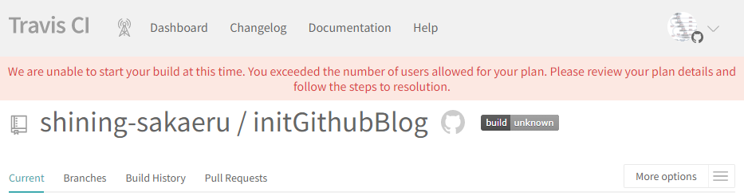
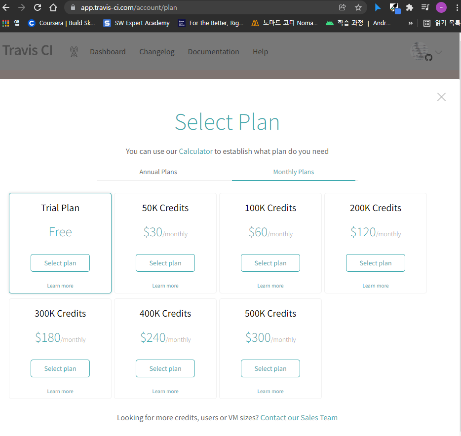
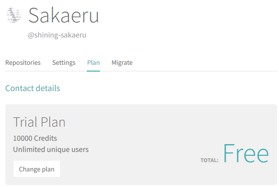
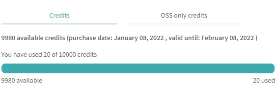
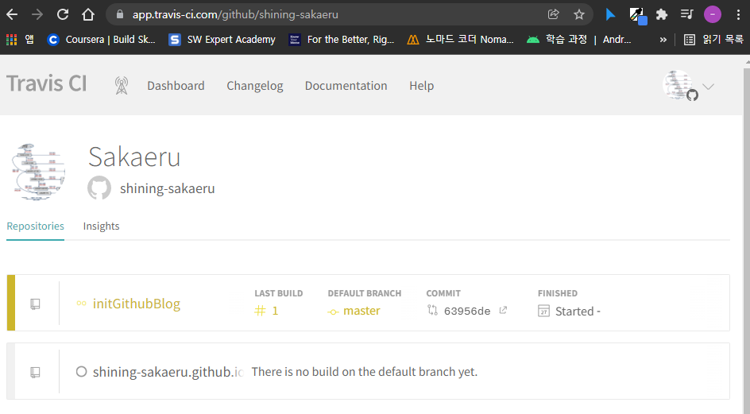
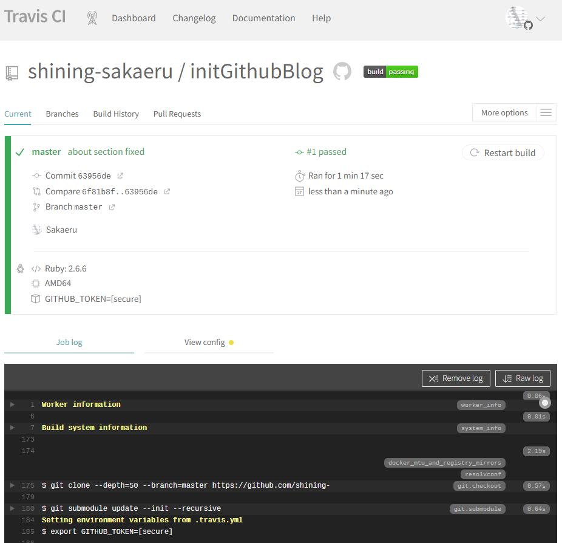

> ## Content Index
> Fetch the complete content index at: http://64.110.107.153:2368/llms.txt
> Use this file to discover other available public pages before exploring further.

# Jekyll 따라하기(8) - Travis CI
- URL: http://64.110.107.153:2368/jekyll-travisci/
- Published: 2021-01-08T10:00:00.000Z
- Updated: 2021-01-08T10:00:00.000Z
- Author: Noah Sim

Jekyll 따라하기의 목차입니다.

- [Jekyll 따라하기(0) - Jekyll Start](./jekyll-start)
- [Jekyll 따라하기(1) - Jekyll Setup](./jekyll-setup)
- [Jekyll 따라하기(2) - Jekyll Modify and Publish](./jekyll-modifyAndPublish)
- [Jekyll 따라하기(3) - Jekyll Web Font](./jekyll-webFont)
- [Jekyll 따라하기(4) - Highlighting with rouge](./jekyll-highlighting)
- [Jekyll 따라하기(5) - Search function with lunr.js](./jekyll-searchFunction)
- [Jekyll 따라하기(6) - Google Search Console](./jekyll-googleSearchConsole)
- [Jekyll 따라하기(7) - GitHub Gist](./jekyll-gitHubGist)
- [Jekyll 따라하기(8) - Travis CI](./jekyll-travisCI)

github blog 사용을 위한 Jykell Setup 과정입니다.

- Reference: https://moon9342.github.io/jekyll-travis-ci-public

---

1. Source Folder 및 Target Folder 준비  
> Source Folder: Before Compile Target Folder: After Compile
2. Github push  
> 위 2개 Folder에 대한 github repository 생성
3. \_config.yml 설정  
> destination 값을 ./output 을 변경
4. Git Submodule 생성  
> git submodule add https://github.com/github-username/repository.github.io.git output git submodule update
5. Travis계정 생성  
> public으로 생성함.
6. .travis.yml 및 Rakefile 설정  
> 두개 File 생성 및 설정
7. Github Token 생성  
> Setting > Developer settings > Personal access tokens - Generate New Token
8. Token Encrypt. 암호화.  
> gem install travis  
> travis login –pro  
> `travis encrypt GITHUB_TOKEN=<생성한 github token> -r <github username>/<repository>`  
> 생성된 secure code를 .travis.yml 안에 위치한 secure 에 반영함
9. Run Travis CI  
> Source folder에서 git push를 진행  
> Travis CI homepage에서 진행상황 check  
> 자동 build 및 Target folder로 push  
> github.io 홈페이지 업데이트 완료

---

## 2022-01-08

- 현재 travis-ci.org는 사용되지 않으며  
travis-ci.com 를 사용하는 것을 확인.
- cli에서 travis login시 fail. 아래처럼 사용하면 정상 동작함  
> `travis login --com --github-token <생성한 github token>`
- Source folder에서 push시 fail 발생 파악해보니 Travis CI가 유료화 된 것으로 보임  
Trial Plan 사용시 정상 동작하는 것 확인함.  
신용카드 번호 등록해야 하며, VAT ID가 나오는데 필자는 아무렇게나 적어도 문제 없었음.  
아래 이미지들 참고.  
    