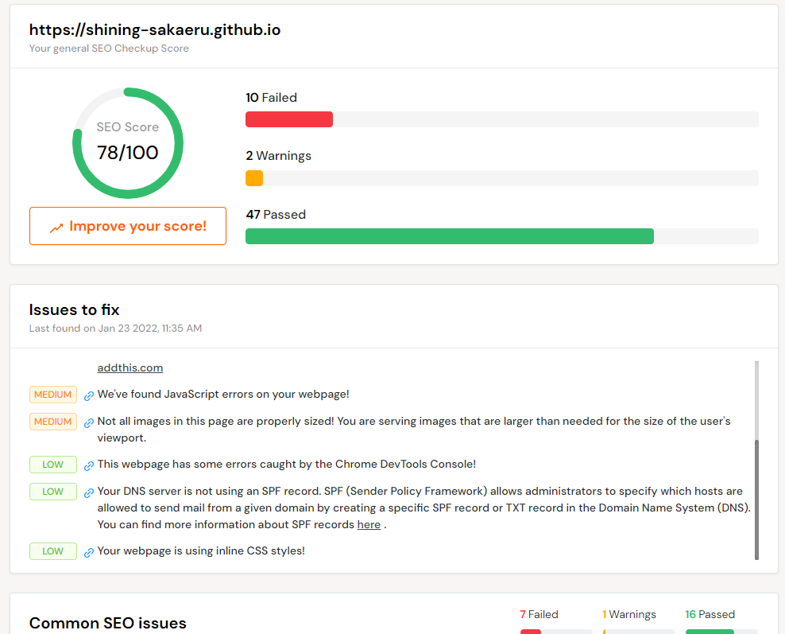

> ## Content Index
> Fetch the complete content index at: http://64.110.107.153:2368/llms.txt
> Use this file to discover other available public pages before exploring further.

# SEO Tool (Search Engine Optimization)
- URL: http://64.110.107.153:2368/web-seo/
- Published: 2021-01-23T10:00:00.000Z
- Updated: 2021-01-23T10:00:00.000Z
- Author: Noah Sim

SEO Tool 소개입니다.

- Reference: https://en.wikipedia.org/wiki/Search\_engine\_optimization

---

SEO. Search Engine Optimization  
한국어로 “검색 엔진 최적화 기술”

Wikipedia define은 아래와 같습니다.

> Search engine optimization (SEO) is the process of improving the quality and quantity of website traffic to a website or a web page from search engines.

웹 검색 엔진에서 트래픽의 질과 양을 향상시키기 위한 프로세스.

이번에는 https://seositecheckup.com/ 를 이용하여 확인해보려 합니다.

---

본 blog의 점수. Issue. 그 이유. 수정 방법이 보기좋게 나와있어 좋네요. 

url만 입력하고 진행하면 특이사항 없이 잘 작동하고 문제점들은 시간될때 수정 해야겠습니다.